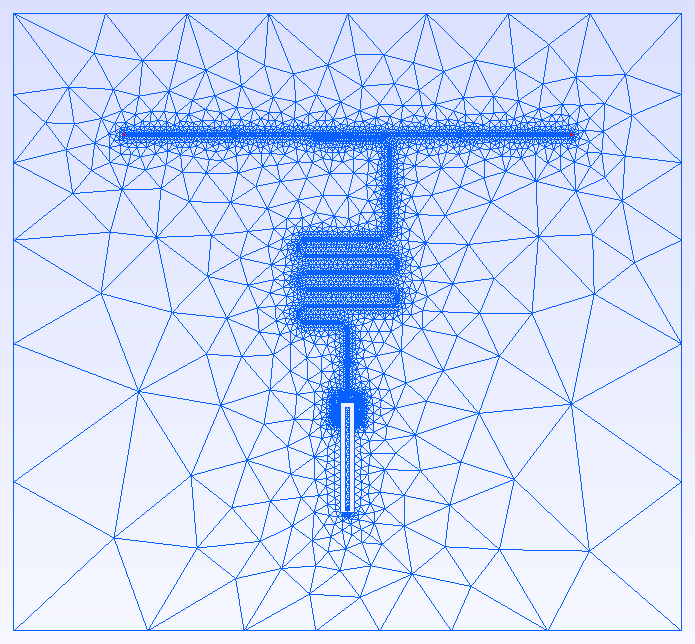

# DeviceLayout.jl

DeviceLayout.jl is a [Julia](http://julialang.org) package for computer-aided design (CAD) of quantum integrated circuits, developed at the AWS Center for Quantum Computing. The package supports 

- **2D layout generation** for fabrication (GDSII export)
- **3D model generation** for electromagnetic simulation
- **Schematic-driven design** for managing complex devices with many components

```@raw html
<div style="display: flex; justify-content: center; gap: 20px; margin: 30px 0;">
<a href="examples/qpu17">  </a>
<a href="examples/singletransmon">  </a>
</div>
```

## Quick Links

| I want to... | Go to... |
|--------------|----------|
| Install DeviceLayout.jl | [Installation](tutorials/getting_started.md#Installation) |
| Set up my workflow | [Workflow Tips](tutorials/getting_started.md#Workflow-tips) |
| Create my first layout | [First Layout](tutorials/first_layout.md) |
| Learn through guided tutorials | [Tutorials](tutorials/index.md) |
| Solve a specific problem | [How-To Guides](how_to/index.md) |
| Understand key concepts | [Concepts](concepts/index.md) |
| Look up API details | [Reference](reference/index.md) |
| See full working examples | [Examples](#Examples) |

## Why DeviceLayout.jl?

- **Rich geometry types** with first-class support for paths
- **Schematic-driven layout**: Manage complexity by separating component geometry and device connectivity
- **3D modeling and meshing** (via [Open CASCADE Technology](https://dev.opencascade.org/) and [Gmsh](https://gmsh.info/)) using rich geometry and schematic information to improve meshing and configure simulations
- **Developed alongside [*Palace*](https://awslabs.github.io/palace/stable/)**, an open-source tool for electromagnetic finite-element analysis
- **Built-in support** for common elements of superconducting quantum processors like coplanar waveguides, air bridges, and flip-chip assemblies
- **Explicit unit support** without sacrificing performance
- **The Julia ecosystem**: Users write code in Julia, a scientific programming language combining high performance and ease of use
- **Package management**: The [Julia package manager](https://pkgdocs.julialang.org/v1/) offers portability and reproducibility for design projects
- **PDK support**: Teams can manage their own process design kit as a set of Julia packages in a private registry

## Quick Start

### Installation

DeviceLayout.jl requires Julia v1.10 or later. You can follow [these instructions](https://julialang.org/install/) to install Julia.

From Julia, install DeviceLayout.jl using the built-in package manager, [Pkg.jl](https://pkgdocs.julialang.org/v1/getting-started/):

```julia
julia> ] # Pressing ] in the Julia REPL activates the Pkg REPL mode
pkg> activate . # Activates an environment in the current directory
pkg> add DeviceLayout # Adds DeviceLayout.jl to the environment
pkg> add FileIO # You'll want FileIO too, to save output files
```

!!! tip "Use Project Environments"
    We recommend [using an environment for each project](https://julialang.github.io/Pkg.jl/v1/environments/) rather than installing packages in the default environment. This ensures reproducibility and avoids version conflicts.

### Hello World

```julia
using DeviceLayout, DeviceLayout.PreferredUnits
using FileIO

# Create a cell
cell = Cell("hello")

# Add a rectangle
render!(cell, centered(Rectangle(100μm, 50μm)), GDSMeta(0))

# Save to GDS
save("hello.gds", cell)
```

See [Getting Started](tutorials/getting_started.md) for a more complete introduction, including workflow setup.

## What should I read next?

- **New to DeviceLayout.jl?** Continue with [Getting Started](tutorials/getting_started.md) to set up your environment and workflow.
- **Want to learn systematically?** Head to the [Tutorials](@ref tutorials-index).
- **Have a specific task in mind?** Check the [How-To Guides](@ref how-to-index).
- **Want to understand the concepts?** Read the [Concepts](@ref concepts-index) section.
- **Looking for API details?** Browse the [Reference](@ref reference-index).
- **Want to contribute to DeviceLayout.jl?** Read the [Developer Guide](developer/index.md)

## Examples

Explore what you can build with DeviceLayout.jl:

- [17-qubit quantum processor](examples/qpu17.md) - A complete multi-qubit device layout
- [Single transmon simulation](examples/singletransmon.md) - End-to-end design optimization workflow with Palace
- [Example PDK](examples/examplepdk.md) - PDK used to create the examples

## Community

- [GitHub Repository](https://github.com/aws-cqc/DeviceLayout.jl)
- [Issue Tracker](https://github.com/aws-cqc/DeviceLayout.jl/issues)
- [Contributing Guide](https://github.com/aws-cqc/DeviceLayout.jl/blob/main/CONTRIBUTING.md)
